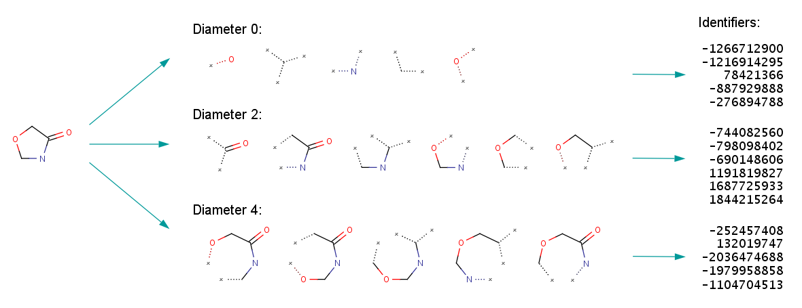
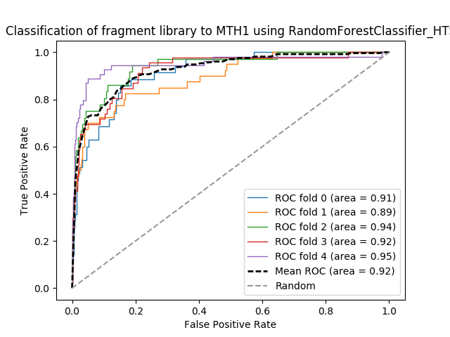

# DSI_Capstone
Predictive Analysis of MTH1 inhibitors.

**Purpose**

Drug development is an expensive and time consuming endeavor reflected in the rising cost of novel pharmaceuticals. Computational screening of large molecule libraries can reduce cost associated with exploratory assays of novel drug targets.  MTH1 is a novel cancer target involved in maintenance of reactive oxygen species produced in rapidly dividing cancer cells. By inhibiting the molecular function of this enzyme we can selectively target cancer cells while minimizing negative side effects to the patient. A machine-learning algorithm will be trained on molecule fragment screening results and developed to score libraries of small molecules for the inhibition of MTH1.

**MTH1 Inhibition**

https://www.youtube.com/watch?v=NAPYaSQPios

**Fragment Screening Approach**

**Data Collection and Preperation**
452 molecule ligand fragments were tested for activity towards the MTH1 target and scored as hit (1) or not a hit (0).
   * Hit Classification: The change in melting temperature of the target was determined in presence of each ligand fragment. Ligands which bind (at equilibrium) usually increase the protein thermal stability (indicated by the melting temperature) by an amount proportional to the concentration and affinity of the ligand. Therefore, the change in melting temperature of the ligand in the presence of a ligand or ligand fragment can be used to indicate binding affinity. We scored any ligand fragment with a change in melting temperature equal to or greater than 5°C to be a binding "hit".
   
   * Chemical Descriptors: Descriptors of the ligand fragments were generated using RDKIt nodes in Knime, and are a combination of fingerprints (Morgan, 1024 bits, radius 4) and physicochemical properties (all available). The Morgan fingerprints were expanded into 1024 columns, resulting in a final descriptor matrix of 1130 columns.
   **Chemical Fingerprint Generation**
   

**Model Selection**
Various classifier models were tested on subsets of the feature space. Cross fold validation grid search was preformed for random forest and logistic regression models. The structure and hyperparameters of the neural net were explored through manual tunning. The goal of this screen is to identify promising ligands for further investigation, therefore we are willing to accept some ammount of false positives in order to increase the amount of true positives captured. Therefore the threshold was tuned in order to maximize recall while allowing the model precision to suffer. Model stacking was attempted but no increase in recall or precision was forthcoming. A neural network classifier and random forest classifer yeilded similar results, however the random forest classifer provides the added benefit of yeilding feature importance therefor it will be the model emplimented as I move forward.
Random Forest trained on all features (# training set):
 precision: 0.20
 recall: 0.89

Confusion Matrix  | -----------------
------------- | -------------      
TP  | FP
FN  | TP

---Fragment Test Data ---   | -----------------
------------- | -------------
50  | 32
1  | 8

**Next Steps**
* A) deploy web app
* B) **test trained model on ligand fragment screen with ligand screening data**

Below is a ROC on the test (ligand screen) data. I think it looks good.... BUT the confusion matrix I build (with varying thresholds) doesn't look so good to me. Am I missing something?
             
  rh.print_threshold(rffit, HTS_features, HTS_y, 0.3)
 precision: 0.07
 recall: 0.88
 
  

Confusion Matrix  | -----------------
------------- | -------------      
TP  | FP
FN  | TP

---HTS screen---   | -----------------
------------- | -------------
2807  | 2461
25  | 186

* B.2) test this data with other classifiers (NN)
Conclusion: Not any better
 rh.print_threshold(estimator_fit, HTS_features.values, HTS_y, 0.002)
('precision:', 0.061463046757164401)
('recall:', 0.77251184834123221)
 
 

Confusion Matrix  | -----------------
------------------| -------------      
TP  | FP
FN  | TP

---HTS screen---   | -----------------
------------- | -------------
2779  | 2489
48  | 163

* C) collect and report recall and precision for all models and feature spaces tested
* D) insert ROC curves
* E) preform PCA and feed into classifiers
* F) fix my xgboost package

**References**
1.	G. M. Dimitri, P. Lio, DrugClust: A machine learning approach for drugs side effects prediction. Computational biology and chemistry 68, 204 (Jun, 2017).
2.	A. Lavecchia, Machine-learning approaches in drug discovery: methods and applications. Drug discovery today 20, 318 (Mar, 2015).
3.	A. N. Lima et al., Use of machine learning approaches for novel drug discovery. Expert opinion on drug discovery 11, 225 (2016).
4.	M. Vass et al., Molecular interaction fingerprint approaches for GPCR drug discovery. Current opinion in pharmacology 30, 59 (Oct, 2016).
5. http://www.proteos.com/services/assay-services/thermal-shift-analysis (image, melting temperature)
6. P. J. Hajduk, W. R. Galloway, D. R. Spring, Drug discovery: A question of library design. Nature 470, 42 (Feb 03, 2011).(image, fragment screen)

**Code References**

5. https://github.com/oddt/rfscorevs
6. http://istar.cse.cuhk.edu.hk/, https://github.com/HongjianLi/istar

7. http://silicos-it.be.s3-website-eu-west1.amazonaws.com/cookbook/configuring_osx_for_chemoinformatics/configuring_osx_for_chemoinformatics.html#rdkit
8. https://github.com/rdkit/rdkit
9. https://github.com/MaxHalford/Prince/blob/master/docs/mca.rst
